# Project #1 - Drawing App

This Android project is a simple drawing application, ideal for beginners. It allows users to draw on the screen with different colors, adjust line weight, save images, and load saved images to continue drawing.

## Features:
- Draw on the screen with various colors.
- Adjust line weight for precise drawing.
- Save drawings as images.
- Load saved images to continue drawing.

## Technologies Used:
- Kotlin
- Android SDK

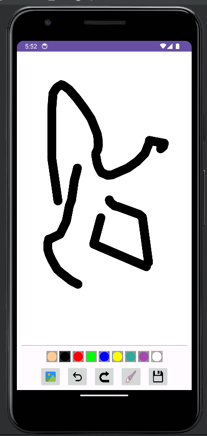 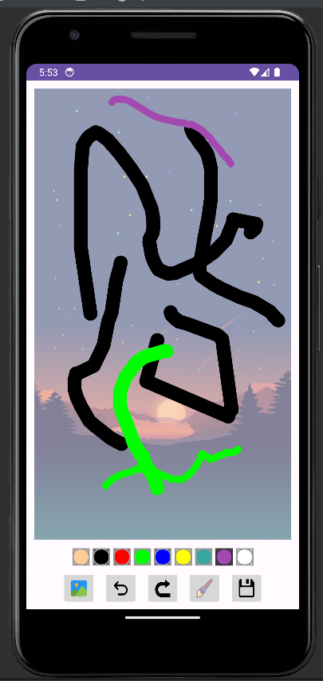

---

# Project #2 - RoomDemo App

The RoomDemo app is a project created for learning purposes, focusing on exploring the capabilities of Room, a persistence library provided by Android Jetpack. This application serves as a practical demonstration of Room's features and functionalities.

## Features:
- Manages a list of employees in a SQLite database.
- Displays the list of employees on the screen using a RecyclerView and an item adapter.
- Allows users to update or delete existing employee entries.

## Technologies Used:
- Java/Kotlin
- Room Persistence Library
- RecyclerView and ItemAdapter
- Android SDK

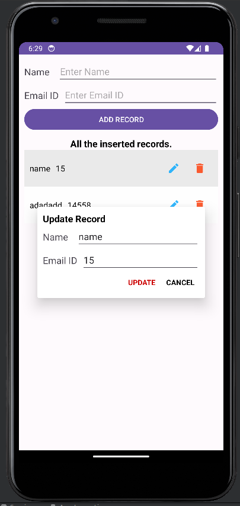 

---

# Project #3 - Workout App

The Workout app is a delightful project that offers users a comprehensive platform for creating and following personalized workout routines. With a rich database of exercises and accompanying images, users can easily select exercises that suit their fitness goals and preferences.

## Features:
- Access to a database of exercises with associated images.
- Create customized workout routines by selecting exercises from the database.
- Perform workouts with built-in timers and alerts for exercise changes/endings.
- Track workout progress and performance over time.

## Technologies Used:
- Kotlin
- SQLite Database
- Timer and Alert functionalities
- Android SDK

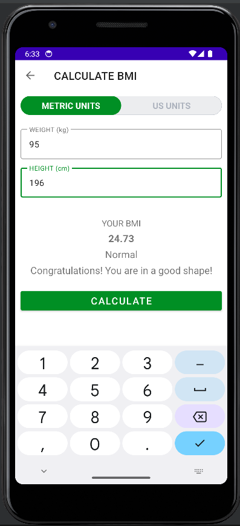 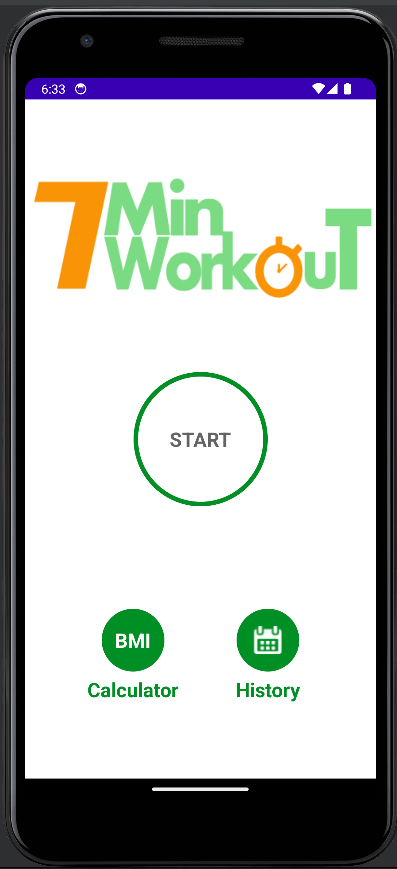 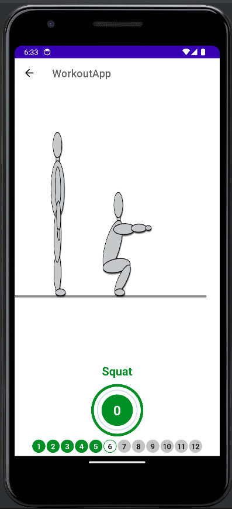 
---

# Project #4 - Weather App

The Weather app is a project focused on integrating API requests and location-based services to provide users with real-time weather information. Utilizing Retrofit for API requests and LocationServices for location management, this app offers a seamless experience for users to retrieve weather data based on their current location.

## Features:
- Retrieves real-time weather data based on user's location.
- Utilizes Retrofit for making API requests.
- Implements permission management for accessing location information.
- Displays weather information on the screen for users to view.

## Technologies Used:
-LocationServicesKotlin
- Retrofit
- LocationServices
- Android SDK

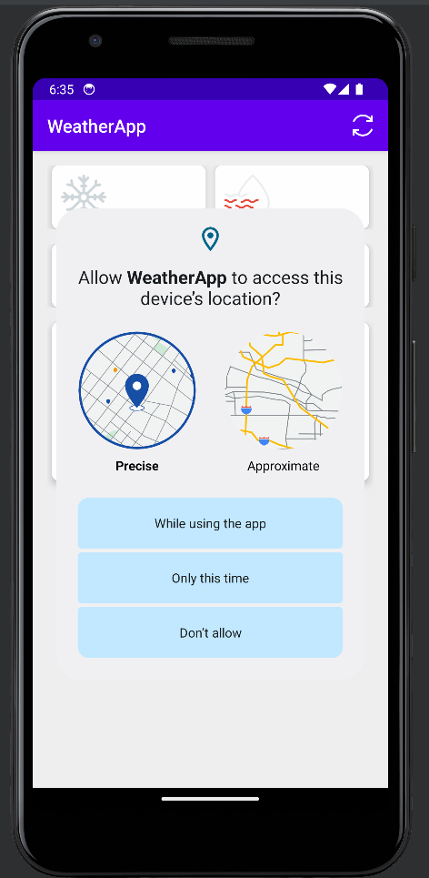 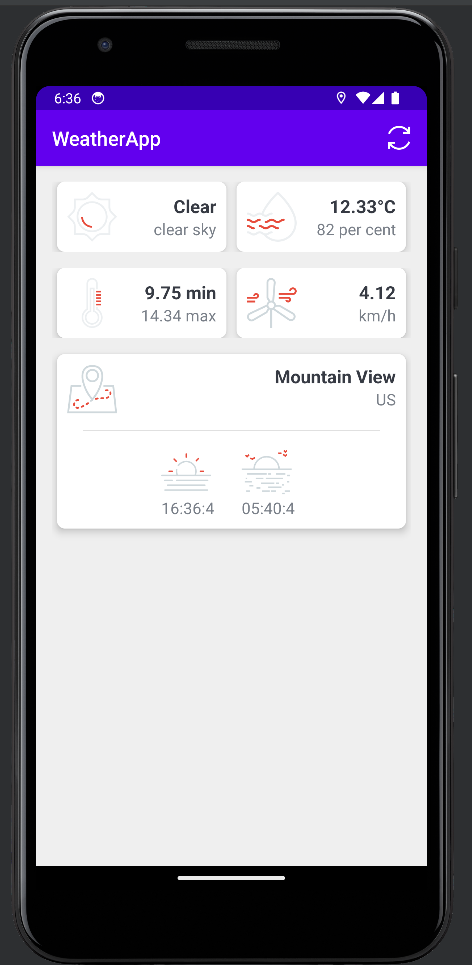
---

# Project #5 - Quiz App

The Quiz app is an engaging project designed to challenge users' knowledge on various topics. With a database of questions, including correct answers and multiple choice options, users can select their preferred quiz difficulty and test their knowledge against a timer.

## Features:
- Offers quizzes on various topics with questions stored in a database.
- Allows users to choose the quiz difficulty.
- Retrieves a set of 10 questions based on the selected difficulty.
- Implements a timer per question to add excitement and challenge.

## Technologies Used:
- Kotlin
- SQLite Database
- Timer functionality
- Android SDK

---

# Project #6 - HappyPlaces App

The HappyPlaces app is a project that serves as a personal diary of memorable locations. Users can save locations along with images, creating a collection of their happy moments. This app incorporates user authentication, allowing each user to have their own account to securely manage their happy places.

## Features:
- Users can create an account to access the app's features securely.
- Allows users to save locations with associated images.
- Provides a map view powered by Google Maps API to visualize saved places.
- Utilizes Google Location Services to pinpoint the user's location and facilitate the selection of places to save.
- Enables users to add, edit, and delete their happy places as desired.
- Utilizes RecyclerView and item adapters for displaying and managing the list of happy places, providing a seamless and efficient user experience.
- Implements a clean and intuitive user interface, making it easy for users to navigate and interact with the app's features.

## Technologies Used:
- Kotlin
- Google Maps API
- RecyclerView and Item Adapters
- Image Storage
- Android SDK

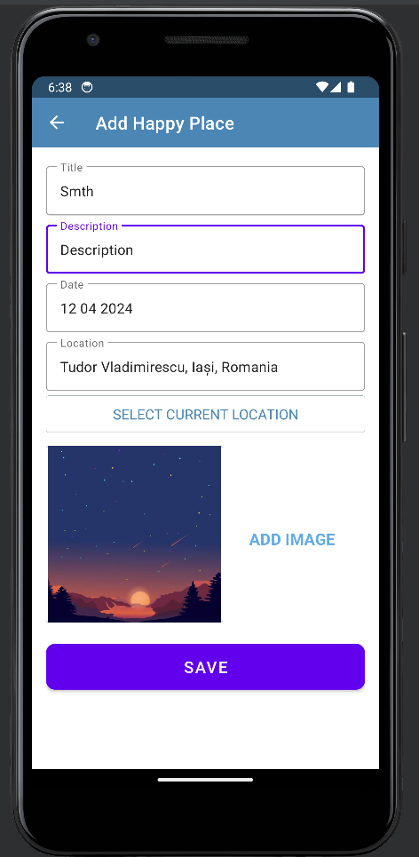 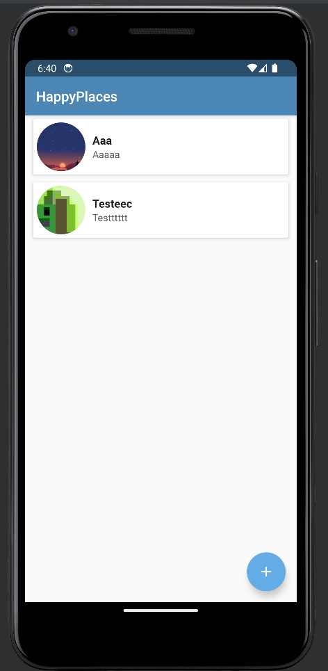
---

# Project #7 - Trello Clone

This Task Management Tool is a project designed to provide users with a versatile platform for managing tasks and collaborating with team members. Inspired by Trello, this app offers a wide range of features to streamline task organization and enhance productivity.

## Features:
- Users can create tasks and subtasks, allowing for granular management of project elements.
- Assign tasks to specific users, facilitating team collaboration and task delegation.
- Enable comments on tasks to encourage communication and provide context.
- Implement drag-and-drop functionality to move tasks between different stages or categories.
- Allow users to set priorities for tasks and mark them as complete or in progress.
- Utilizes Firebase for authentication, storage, and messaging, ensuring secure user access and real-time notifications on task updates, assignments, etc.
- Provides a clean and intuitive user interface, ensuring ease of use and efficient task management.
- Incorporates real-time updates to ensure that all team members have access to the latest information and changes.

## Technologies Used:
- Kotlin
- Firebase Authentication, Storage, and Messaging
- RecyclerView and Item Adapters
- Drag-and-Drop functionality
- Android SDK

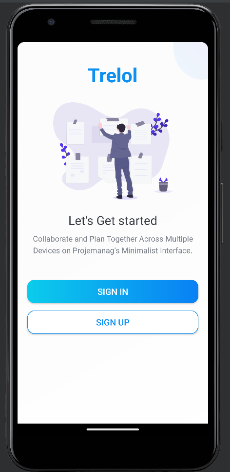 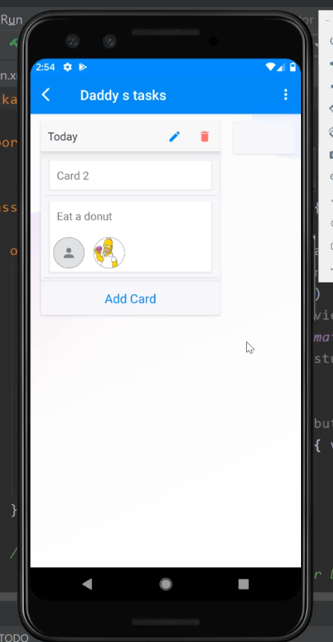 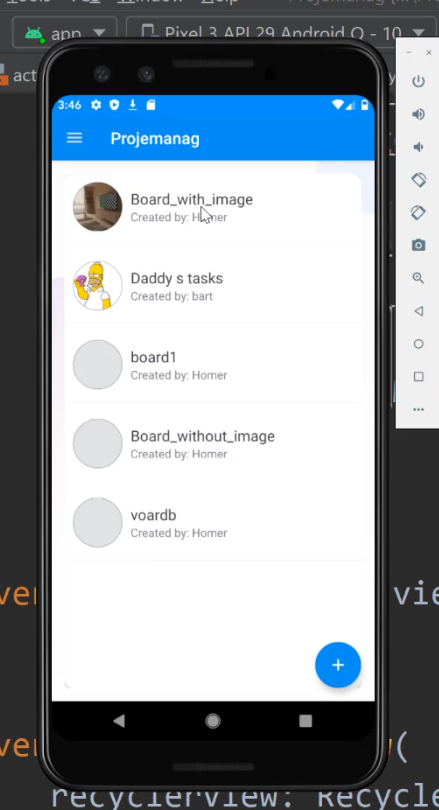
---

